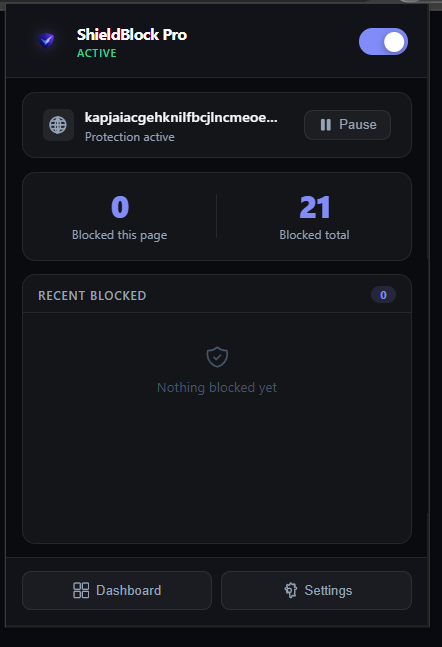
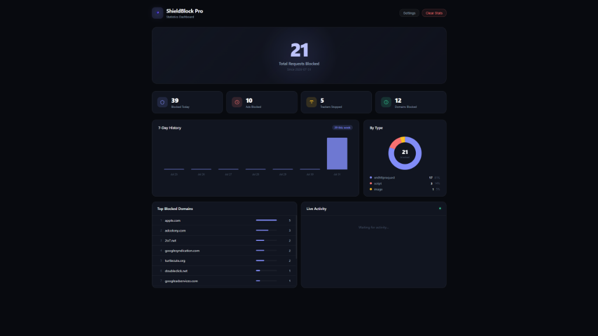
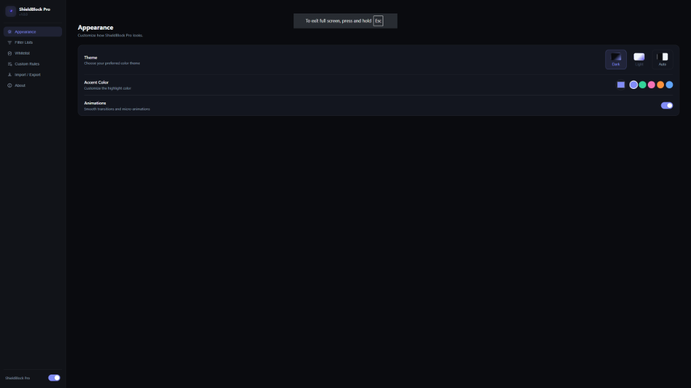
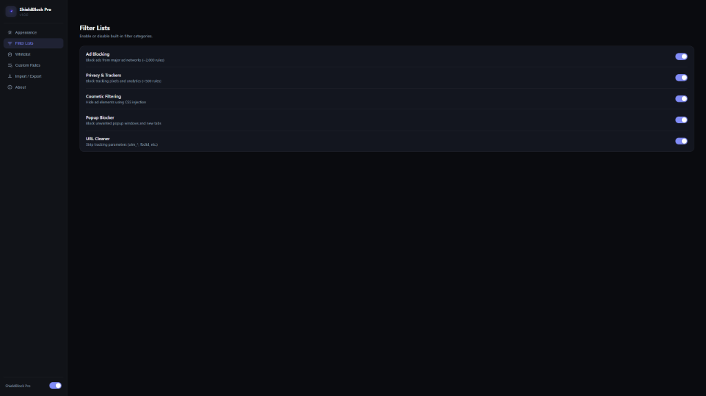
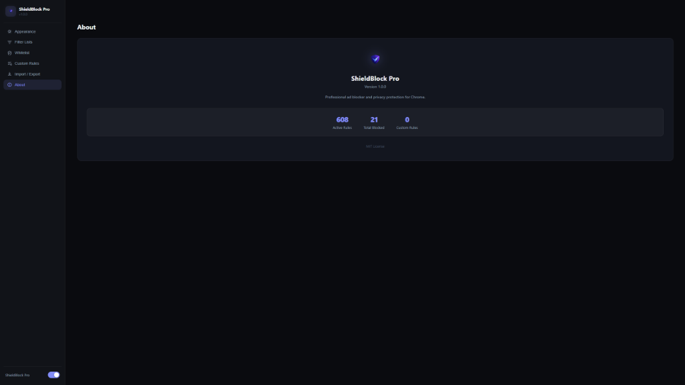

<div align="center">


# 🛡️ ShieldBlock Pro

### Professional Manifest V3 Ad Blocker for Chromium Browsers

Fast • Lightweight • Privacy Focused • Open Source


A modern privacy-first browser extension built with Manifest V3 that blocks advertisements, trackers, popup windows, cookie banners, and tracking URLs while providing a beautiful real-time statistics dashboard.

</div>

---

# ✨ Features

| Feature | Description |
|----------|-------------|
| 🚫 Network Ad Blocking | Blocks advertising requests using Manifest V3 DeclarativeNetRequest |
| 🎨 Cosmetic Filtering | Hides banners, floating ads, cookie notices and sponsored content |
| 🪟 Popup Blocker | Prevents unwanted popup windows and redirects |
| 🔗 URL Cleaner | Removes tracking parameters like UTM, fbclid and more |
| 📊 Live Statistics | Real-time blocked request statistics |
| 🔔 Badge Counter | Live badge showing blocked requests |
| ✅ Whitelist | Permanent and temporary website exceptions |
| ⚙️ Dashboard | Beautiful analytics dashboard |
| 🌙 Modern UI | Glassmorphism-inspired dark interface |
| ⚡ Lightweight | Optimized for performance and low memory usage |

---

# 📸 Screenshots

---

## 🛡️ Popup

<p align="center">

</p>

<p align="center">
Compact popup providing instant protection controls, live blocking statistics, recent activity, and quick access to the Dashboard and Settings.
</p>

---

## 📊 Statistics Dashboard

<p align="center">

</p>

<p align="center">
Interactive analytics dashboard with real-time request statistics, activity history, blocked domains, request type breakdown, and live monitoring.
</p>

---

## 🎨 Appearance Settings

<p align="center">

</p>

<p align="center">
Personalize ShieldBlock Pro with dark/light themes, multiple accent colors, and smooth UI animations.
</p>

---

## 🛡️ Filter Lists

<p align="center">

</p>

<p align="center">
Enable or disable individual protection modules including Network Ad Blocking, Privacy Protection, Cosmetic Filtering, Popup Blocking, and URL Cleaning.
</p>

---

## ℹ️ About

<p align="center">

</p>

<p align="center">
Displays extension version, active rules, total blocked requests, custom rule count, and project information.
</p>

---

# ⚡ Performance

ShieldBlock Pro is designed for speed and efficiency.

- ✅ Manifest V3 architecture
- ✅ Background Service Worker
- ✅ Optimized rule engine
- ✅ Lightweight memory usage
- ✅ Fast startup
- ✅ Modular architecture
- ✅ Efficient storage management
- ✅ Real-time statistics engine

---

# 🏗 Architecture

```text
Browser
     │
     ▼
Manifest V3
     │
     ▼
Background Service Worker
     │
     ├── Rule Engine
     ├── Stats Engine
     ├── Badge Manager
     ├── Message Router
     ├── Whitelist Manager
     └── Storage
              │
      ┌───────┴────────┐
      ▼                ▼
 Popup UI        Dashboard UI
      │                │
      └────────┬───────┘
               ▼
        Chrome Storage API
```

---

# 📂 Project Structure

```text
shieldblock-pro/
│
├── manifest.json
│
├── assets/
│   ├── logo.png
│   ├── icons/
│   └── screenshots/
│       ├── popup.png
│       ├── dashboard.png
│       ├── settings-appearance.png
│       ├── settings-filterlists.png
│       └── about.png
│
├── background/
│   ├── index.js
│   ├── RuleEngine.js
│   ├── StatsEngine.js
│   ├── BadgeManager.js
│   ├── MessageRouter.js
│   ├── WhitelistManager.js
│   └── ...
│
├── content/
│   ├── CosmeticEngine.js
│   ├── PopupBlocker.js
│   ├── AntiRedirect.js
│   ├── ResourceObserver.js
│   └── ...
│
├── popup/
├── dashboard/
├── options/
├── rules/
├── shared/
└── scripts/
```

---

# 🛠 Technology Stack

- JavaScript (ES6)
- Manifest V3
- Chrome Extensions API
- DeclarativeNetRequest API
- Chrome Storage API
- MutationObserver
- CSS3
- HTML5

---

# 🚀 Installation

Clone the repository

```bash
git clone https://github.com/Vikki-2006/ShieldBlock-Pro.git
```

Open Chrome

```
chrome://extensions
```

Enable

```
Developer Mode
```

Click

```
Load unpacked
```

Select the cloned project folder.

Done! 🎉

---

# 📋 Roadmap

- [ ] EasyList integration
- [ ] Custom filter subscriptions
- [ ] Sync settings
- [ ] Backup & Restore
- [ ] Website-specific rules
- [ ] Enhanced tracker protection
- [ ] Performance optimizations
- [ ] AI-assisted filter suggestions

---

# 🤝 Contributing

Contributions are welcome!

1. Fork the repository
2. Create a new feature branch

```bash
git checkout -b feature/my-feature
```

3. Commit your changes

```bash
git commit -m "Add awesome feature"
```

4. Push to GitHub

```bash
git push origin feature/my-feature
```

5. Open a Pull Request

---

# 📜 License

This project is licensed under the **MIT License**.

See the LICENSE file for more information.

---

<div align="center">

If you found this project useful, consider giving it a ⭐ on GitHub!

</div>
